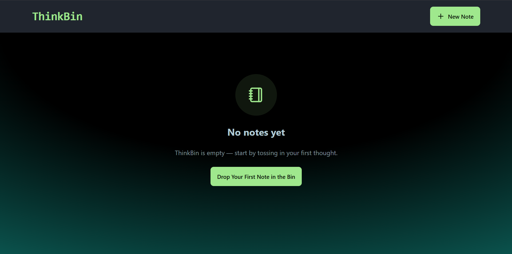
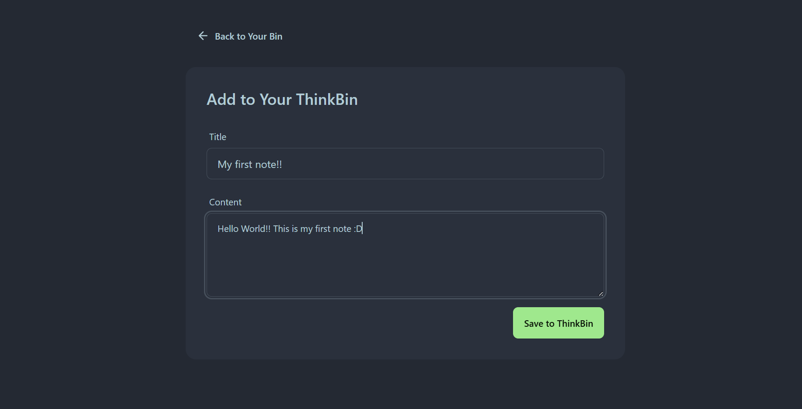
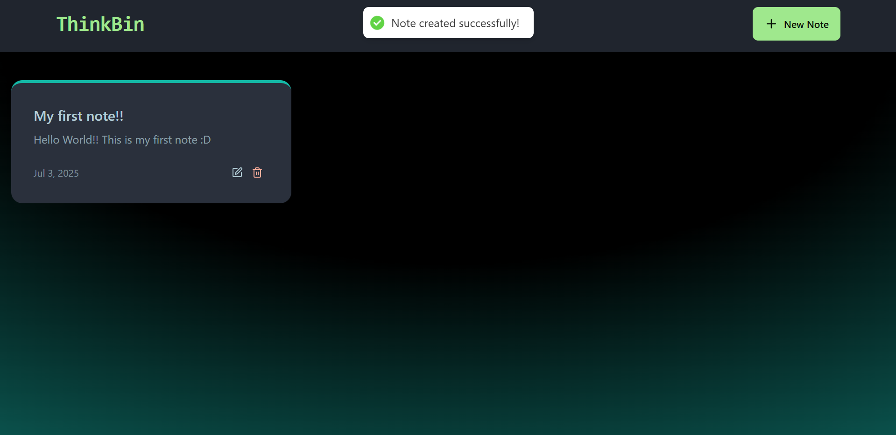

# 🧠 ThinkBin

**ThinkBin** is a modern note-taking web app built using the MERN stack. It's designed to help you organize your thoughts quickly and efficiently — write, edit, and delete notes seamlessly.

---

## 🚀 Features

- 📝 Create, update, and delete notes
- 🌐 Rate limiting with Upstash Redis
- 💾 MongoDB-based persistent storage
- ✨ Responsive UI built with Tailwind CSS and DaisyUI
- 🔥 Toast notifications for actions
- 🧠 Dark-themed design inspired by productivity apps

---

## Backend (`/backend`) Environment Variables

* `MONGO_URI=<your_mongo_uri>`
* `UPSTASH_REDIS_REST_URL=<your_redis_rest_url>`
* `UPSTASH_REDIS_REST_TOKEN=<your_redis_rest_token>`
* `NODE_ENV=development`

---






---

## How to Run the Application

### 🔧 Run the Backend

1.  Navigate to the backend directory:
    ```bash
    cd backend
    ```
2.  Install dependencies:
    ```bash
    npm install
    ```
3.  Start the development server:
    ```bash
    npm run dev
    ```

### 💻 Run the Frontend

1.  Navigate to the frontend directory:
    ```bash
    cd frontend
    ```
2.  Install dependencies:
    ```bash
    npm install
    ```
3.  Start the development server:
    ```bash
    npm run dev
    ```
